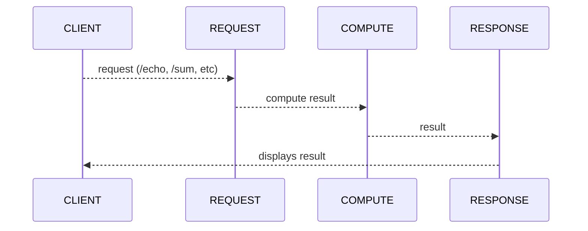

## Basic Web Server for Matrix Operations
What this does:
- [ ] Starts webserver using the configurations in the [config file](https://github.com/ogonna-anaekwe/matrixserver/tree/main/config.yml)
- [ ] Reads and Validates [matrix data](https://github.com/ogonna-anaekwe/matrixserver/tree/main/matrix.csv). 
- [ ] Accepts requests on the configured port
- [ ] Routes request to the appropriate method. There is a method for each route. These are hooked up in [cmd/main.go](https://github.com/ogonna-anaekwe/matrixserver/blob/main/cmd/main.go)
- [ ] Computes result and display to users.

## Sequence


## Dependencies
To run this application you need the following dependencies on your local machine:
- [Docker Desktop](https://www.docker.com/products/docker-desktop/).
- [Make](https://www.gnu.org/software/make/)

Validate you have both:
```sh
docker --version & make --version
```
If it fails, it means you're missing at least one dependency. Follow the appropriate link in the aforementioned dependencies to install.

## Run locally
**Note:** Every command that follows (with the exception of `git clone ...`) should be run from the root of the project `./matrixserver`.

To run: 
1. Clone the repo:
```sh
git clone git@github.com:ogonna-anaekwe/matrixserver.git
```
2. Start the service (in one terminal and leave the terminal open):
```sh
make start
```

3. In another terminal
```sh
curl http://localhost:8080/echo # print matrix
curl http://localhost:8080/sum # compute sum of matrix
curl http://localhost:8080/multiply # compute product of matrix
curl http://localhost:8080/flatten # flatten matrix and print
curl http://localhost:8080/invert # invert / transpose matrix and print
```

After starting the service you can run unit tests with:
```sh
make test
```

## Stop Service
Shut down the service and remove all outputed files and (docker) images/networks:
```sh
make stop
```